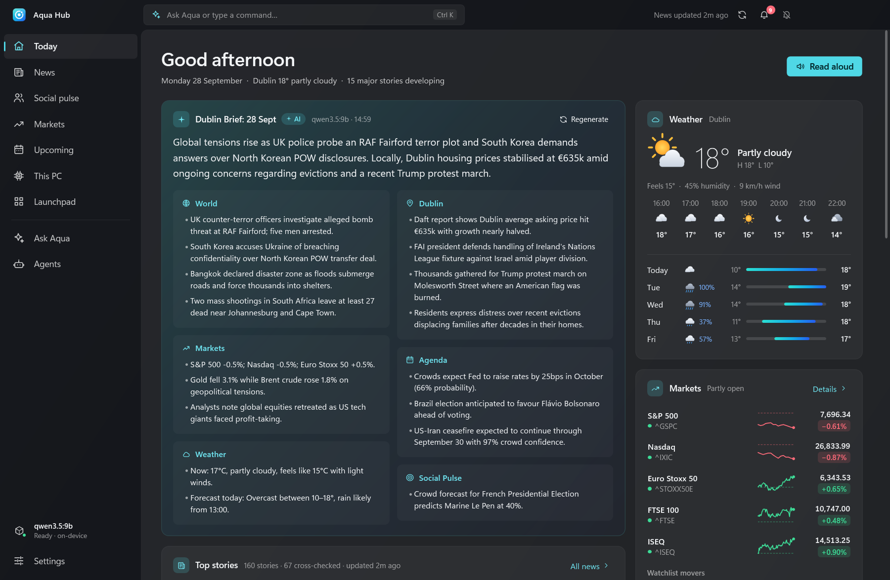

# Aqua Hub

**A private, agent-driven personal hub for Windows.** Aqua Hub's agents read reliable news, your local
social feeds, the markets, prediction markets, your calendar and the weather, then tell you what matters
in a one-minute brief, a native dashboard, a taskbar quick panel and a global command palette.
All AI runs on your PC.



## Highlights

- **Daily brief, written for you** – morning and evening, grounded in cross-checked sources, readable in
  under a minute, with read-aloud (on-device voices).
- **News without the noise** – headlines from Reuters, AP, BBC, FT, The Guardian, DW, Ars Technica, Gamers Nexus
  and more (a *Gaming & internet* section adds Kotaku, Eurogamer, VGC, Dexerto, Insider Gaming and the Daily Dot),
  plus your own country's: its outlets where Aqua knows them (RTÉ, The Irish Times… in Ireland) or its
  Google News edition (type an outlet's name in the News filter to see only its stories). Coverage of the same story is merged into one card with a TL;DR, key points, "why it
  matters" and every source one click away.
- **Local pulse instead of doom-scrolling** – your subreddits, Mastodon hashtags, Bluesky accounts and
  feeds, YouTube channels (paste youtube.com/@name — name and logo are filled in), any RSS bridge and — if you connect them — your own Bluesky *Following* and
  Mastodon *home* timelines, distilled into 3–6 topics with sentiment. Global Bluesky trends are shown
  separately and labelled as global, so they never masquerade as local chatter.
- **Markets** – batched live quotes, interactive charts, a chart row you arrange yourself (*Edit charts*: move,
  remove, add from search), transparent technical signals (trend, momentum, RSI, MACD, 52-week position), an AI
  stance per watchlist symbol with rationale and risks, balanced ideas (diversification, position sizing),
  price-target alerts, and each symbol's page on Yahoo Finance, Google Finance or its exchange one click away. A
  **portfolio card** values your holdings (fractional shares welcome) in your own currency: today's move, the gain
  since you bought (in the currency you paid with) and a 1M/6M/1Y chart of today's holdings at past prices, with
  exchange rates from the same quote service. Session-aware:
  on a weekend it says "Markets closed · figures from Fri close" instead of pretending they moved today.
  *Educational analysis, not financial advice. Aqua Hub never trades.*
- **What's coming** – calendars (ICS), public holidays, high-impact economic releases, earnings, and
  what prediction markets (Polymarket, Kalshi) expect, with 24-hour swings.
- **Your PC** – CPU, memory, GPU/VRAM (any vendor), disks, network, top apps and a local-AI runtime panel
  (loaded models, VRAM, tokens/s, *Free VRAM*). A **health check** reads what Windows already knows — drive
  space and drive health, Windows Update, blue screens and app crashes, antivirus, device errors, battery wear,
  startup apps, clutter — and the local model sums it up, with a button for the Windows tool that fixes each
  finding (read-only; Ask can run it too). Select an app to see what it is, find its file, look it up, ask about
  it or end it (it asks first, closes windowed apps politely and refuses anything Windows needs). A **Doctor's
  toolkit** opens Windows' own maintenance tools, and each drive opens in Explorer or Disk Cleanup.
- **Control** – launch/focus/close your apps, control whatever is playing (Spotify, browsers…; Now Playing keeps
  up as tracks and players change, artwork included), volume,
  and **scenes** that chain actions (e.g. *Game mode*: pause AI + free VRAM + hold notifications + open Steam).
- **Ask Aqua** – an assistant over everything your agents collected (stories with every outlet and summary,
  posts, markets, odds, agenda), with citations you can click. Before answering it plans: proper search
  queries (not your sentence pasted in), links to open, a site to search through, the words a file's name
  probably has and what a picture shows — you see the plan in the answer's activity list. Switch on **Web** to
  look things up and open any link you give it, **Research** for a cited report, **Think** for harder questions
  (pick the **model** that answers right there; Think and Research are remembered for each model, and Think is
  greyed out for a model without a thinking mode, such as Gemma 3),
  or **Use my PC** to find files (by name, by text, or by *looking at* your pictures — "my logo photo of a blue
  flame"), see your screen, and — with your OK each time — open files, links, apps and Windows settings,
  work in app windows (read, click, type, shortcuts — never terminals or anything that runs commands) or run
  your scenes. Ask can put Aqua's own agents to work too: *"refresh the news and tell me what's new"*, *"get the
  latest prices"* or *"write me a fresh brief"* runs them first and answers from what they bring in, and a question
  about your portfolio sees your holdings. Attach documents, spreadsheets, PDFs,
  images or a screenshot of any screen or window, a **folder** (Ask searches and reads it in that chat, even with
  Use my PC off), or **speak** your question — with Windows' recognizer (offline,
  from the microphone you pick; the local model fixes words it plainly misheard) or, far more accurately, with
  **Whisper** on this PC, installed in one click from Settings (whisper.cpp and a 57–547 MB model, each file checked
  against its published SHA-256); Settings has a live test. Answers and your questions are
  selectable; copy or **edit and re-ask** a question, have an answer **read aloud**, and watch the **context
  meter**. Every chat is kept in a searchable **history** — star the ones to keep; the rest expire after 30 days
  (your choice). Or press **Ctrl+Alt+Space** anywhere: fuzzy commands, apps, scenes, tickers, earlier chats,
  natural language ("focus mode", "play lofi", "research heat pumps", "what's on my screen", "find my tax
  documents", "remember that…").
- **Workbench** – teach Aqua new **skills** in your own words ("focus time: pause the music, turn on do not
  disturb and open Notepad"): the local model drafts them from Aqua's own tools, you check, try and save them,
  and they're used whenever a request fits. No code runs; actions still ask first. Plus **Memory** — things Aqua
  keeps in mind ("my logos are in Pictures\Brand") — and a list of everything Aqua can do.
- **Smart alerts** – big moves, price targets, breaking multi-source stories, your keywords, prediction
  swings, reminders and PC health. Quiet hours and full-screen games *hold* toasts and deliver one
  summary afterwards; do-not-disturb keeps everything silently in the bell.
- **Taskbar widget** – click the tray icon (or **Ctrl+Alt+H**) for an acrylic quick panel: clock, weather,
  brief, markets, headlines, media controls, PC load, next event, quick launch and a command box. It fits
  any screen (the body scrolls on short displays) and the tray icon can show today's market direction.
- **Everything from the taskbar** – the tray icon: click for the quick panel, double-click for the dashboard,
  middle-click to play/pause, hover for weather, markets, alerts, your next event and what's playing,
  right-click for alerts, media, scenes, read-brief, do-not-disturb and pause-AI. Pin Aqua Hub to the
  taskbar and its jump list offers *Quick panel*, *Ask or command*, *Read my brief aloud*, *Markets* and
  *Settings*; the window's taskbar thumbnail has previous/play/next buttons and the button shows an
  unread-alerts badge.
- **Honest about freshness** – "News updated 4m ago" comes from the collectors' last successful fetch;
  when you're offline a banner says what time the data is from, and the agents catch up by themselves.
- **The local model, managed for you** – turn Ollama on or off from the sidebar, This PC, Agents, the tray,
  Ask or Settings. Aqua stops it while a game (or any app) keeps the GPU busy and starts it again afterwards,
  stops it after a stretch unused to give its RAM back (never while another program is using it), and starts
  it when you ask something — but never overrides your own on/off. A small notice offers to turn it back on.
  Offline, Ask still answers from your agenda, the crowd's odds, markets, weather and matching news, with sources.
- **Accurate by construction** – a story joins another only if it fits the story's core words (no chaining
  through look-alike headlines), place names never link stories on their own, a story is "local" only when
  most of its coverage is, each publisher counts once, and your local news search is scoped to your
  country. There's no default city: choosing your place sets up its country's outlets, subreddits, holidays, stock
  index, units and currency, and moving to another country swaps them, keeping anything you added.

## Why it's light

Native WPF on .NET 10 — no Chromium, no Node, no local web server. Three runtime dependencies: SQLite, Windows'
offline speech recognizer (for dictation) and Velopack (Setup and updates).
The dashboard and quick panel are created on first use and hidden (not destroyed) when you close them, so
reopening is instant and memory can't grow with every open and close; when nothing is on screen the idle
trim hands the working set back to Windows. Agents batch their requests, use conditional downloads and pause
while you game. Measured on this machine (Windows 11, RTX 4070 SUPER, Debug build):

| | Task Manager "Memory" (private working set) | Committed |
|---|---|---|
| In the tray, steady state | 13–18 MB | ~75 MB |
| Dashboard open on Today | ~80 MB | ~125 MB |
| After visiting every page | ~115 MB | ~160 MB |
| Closed to the tray again (after the trim) | 6–11 MB | ~125 MB, flat across repeated open/close |

The local model runs in Ollama's own process (qwen3.5:9b ≈ 6–7 GB of VRAM while loaded; Ollama unloads it
after 10 idle minutes, and *Free VRAM* or the Game mode scene unloads it at once).
See [docs/ARCHITECTURE.md](docs/ARCHITECTURE.md) and [docs/SECURITY.md](docs/SECURITY.md).

## Requirements

- Windows 10 19041+ (Windows 11 22H2+ for Mica/Acrylic)
- The .NET 10 Desktop Runtime (Setup installs it if it's missing); to build from source, the .NET 10 SDK
  (`global.json` picks it)
- Optional but recommended: [Ollama](https://ollama.com) with a model, e.g.
  ```
  ollama pull qwen3.5:9b
  ```
  Suggested models: 12 GB+ VRAM → `qwen3.5:9b` (default); 6–8 GB → `qwen3.5:4b`; CPU-only → `gemma3:4b`
  (no thinking mode, so Ask's Think is off with it). Install several and pick one per chat in Ask.
  Without a model everything still works using fast extractive summaries.

## Install

Download `AquaHub.App-win-Setup.exe` from the repository's **Releases** page and run it: it installs for your
Windows account only, without administrator rights, and adds Start menu and desktop shortcuts. If the .NET 10
Desktop Runtime is missing, Setup installs it first, and Windows asks you to approve that one step. The installer
isn't code-signed, so Windows SmartScreen may say it "protected your PC": choose *More info* → *Run anyway*.

Installed copies tell you about new versions and update when you say so. About once a day Aqua Hub checks the
releases and, when there's a new version, says so: a banner across the window, a dot on Settings and an alert (again
after ten days or more if it's still not installed). *What's new* shows the release notes, *Download* fetches it with
a progress bar, and *Restart now* installs it (or it installs itself the next time Aqua Hub starts); *Not now* puts
the banner away until the next step. Aqua Hub 1.0.0 ran on .NET 9; later versions run on .NET 10, so the first update to one
of them installs the .NET 10 Desktop Runtime first if it's missing (with the same approval prompt). Your settings and history stay where they are, in
`%LOCALAPPDATA%\AquaHub`. To uninstall, use Windows Settings › Apps.

## Build & run

```powershell
./scripts/build.ps1            # restore (locked), build, unit tests, package audit (stops at the first failure)
./scripts/publish.ps1          # framework-dependent Release build → ./publish/AquaHub.exe
./publish/AquaHub.exe
```

A build from source runs the same app but doesn't update itself.

First launch walks you through your place, interests, local AI and autostart. Nothing is assumed about where you
are: search for your town, or press *Use my location* to let Windows say roughly where this PC is (you can skip it
and choose later in Settings › Location & weather; until then there's no weather or local news). Close the window
and Aqua Hub keeps running in the tray.

| Shortcut | Action |
|---|---|
| Ctrl+Alt+H | Quick panel (taskbar widget) |
| Ctrl+Alt+Space | Command palette / Ask Aqua from anywhere |
| Ctrl+K | Command palette inside the app |
| Ctrl+1 … Ctrl+9, Ctrl+, | Jump between pages, Settings |
| F5 | Refresh everything |
| Ctrl+F | Search Settings (on the Settings page) |

If another app already owns a global shortcut, Aqua picks a free alternative (e.g. Ctrl+Alt+Q for the
quick panel, Ctrl+Alt+K for the palette), saves it, and every hint in the app shows the real one.
**Settings → Shortcuts** lists every shortcut: click a global one and press the keys (Esc cancels, Backspace clears
it, the reset button brings the default back), and Aqua says when Windows or another app already uses them or they
would clash with its own. Settings' search box finds any setting by what it does ("dark mode", "hotkey").

### Command-line

```
AquaHub.exe --background                 start hidden in the tray (used by autostart)
AquaHub.exe --page markets               open on a page (also switches the running instance)
AquaHub.exe --flyout | --palette         toggle the quick panel / palette of the running instance
AquaHub.exe --tray-menu | --quit         open the tray menu / exit the running instance
AquaHub.exe --read-brief                 read the latest brief aloud (starts quietly in the tray if needed)
AquaHub.exe --data-dir D:\profile         use a separate profile (also AQUAHUB_HOME); one instance per profile
AquaHub.exe --snapshot out --data-dir p   headless visual QA: render every page to PNG
AquaHub.exe --snapshot out --measure     off-screen footprint check: writes out/memory.txt
AquaHub.exe --e2e --data-dir p           dry-run sandbox for UI tests: side effects (launching apps, media keys,
                                         volume, speech, autostart, clipboard, toasts…) are journalled, not performed
AquaHub.exe --demo-update [ready]        a pretend release for trying the update banner (Debug builds and --e2e
                                         only): it "downloads" in seconds and installs nothing
```

### Releasing

Push a version tag on a commit that's on `main`, and `.github/workflows/release.yml` builds, tests, packages the
app with [Velopack](https://velopack.io) (Setup, a portable zip, the full update package and, from the second
release on, a delta from the previous one) and publishes the GitHub release that installed copies update from. The
repository has to be public for that.

```powershell
git tag v1.1.0
git push origin v1.1.0
```

## Configuration

Everything is configurable in **Settings** (auto-saved) or directly in
`%LOCALAPPDATA%\AquaHub\settings.json` (comments allowed; *Edit JSON* reloads on save).
Secrets (a free Finnhub key for earnings dates, a Bluesky app password, a Mastodon access token, an
OpenAI-compatible server key, a Brave Search key) go to Windows Credential Manager, never to the JSON file.
Settings › Location & weather holds your place (search, or *Use my location*), units and the language for
summaries and regional news. Settings › Ask Aqua sets what Ask may use: the web and its search engine, planning with the model, how many
pages Research reads, the folders it may read (Documents, Desktop, Downloads and Pictures by default), whether
it may operate app windows and asks before acting or taking screenshots, voice input (Whisper — install or
remove it there — Windows' offline recognizer or Windows online speech), how long unstarred chats are kept, the
context window and how many earlier messages each question sends,
and whether your skills and memories are used.

Not supported by design: X/Twitter, Facebook, Instagram (no public feeds). Any RSS bridge you run
(e.g. RSSHub) can be added as an extra feed.

## Tests

```powershell
dotnet test tests/AquaHub.Tests                      # 750+ unit & behaviour tests (parsers, security, analysis, AI plumbing,
                                                     # settings merge, notification policy, scheduling, fact checks,
                                                     # clustering and fact-check regressions on real data, locale
                                                     # packs, brief sections, offline answers, Ollama policy, Ask:
                                                     # planning, retrieval, article extraction, links, web search
                                                     # parsing, SSRF rules, documents, file search and access,
                                                     # approvals, reasoning guard, chat history, Workbench skills and
                                                     # memory, chat export, logs, dictation (language, tidy-up guard,
                                                     # audio pipe), Whisper (install checks against a fake server,
                                                     # speech trimming, output clean-up), the PC health rules,
                                                     # updates (release address, schedule, alerts, notes), alerts
                                                     # read one at a time, Start with Windows hand-over, the update
                                                     # flow against a fake updater, your place (none until chosen,
                                                     # choosing one, the town lookup), Ask's model picker, a XAML
                                                     # accessibility contract, the agent against a scripted
                                                     # fake Ollama, the collectors and AI agents against a
                                                     # stand-in network and model server, Ask running the agents,
                                                     # exchange rates and the portfolio, Settings search and
                                                     # shortcut clashes, and the update banner's wording)
$env:AQUAHUB_LIVE=1; dotnet test tests/AquaHub.Tests # + 23 live runs against real sources and Ollama (set
                                                     # AQUAHUB_ASK_PROFILE to a profile for the Ask scenarios, and
                                                     # AQUAHUB_WHISPER to a profile's whisper folder for Whisper)
powershell -ExecutionPolicy Bypass -File scripts/e2e.ps1
                                                     # UI Automation end-to-end suite: drives every page, button and
                                                     # window of the real app in a sandboxed dry-run profile
```

The end-to-end suite takes over the mouse and keyboard for 30–60 minutes, so quit your own Aqua Hub first and
leave the PC alone while it runs. `scripts/e2e.ps1` builds a separate copy of the app, and on its first run opens it
on an empty test profile for you to finish onboarding (that becomes the warm profile every test copies). Its build,
profiles and results (`run.log`, screenshots, findings) live in `%LOCALAPPDATA%\AquaHub.E2E`. `-Filter A11` runs one
class, `-Smoke` runs a quick subset (start-up, every page, the palette, Settings and its search, the update banner
and quitting: a few minutes, no model needed), `-Setup` redoes the warm profile, and `-NoBuild` reuses the last build. CI compiles the suite on every push
but doesn't run it: it needs a desktop session, the warm profile and a local model.

## Project status

See [docs/SCORING.md](docs/SCORING.md) for the independent design/usability/viability review rounds.
